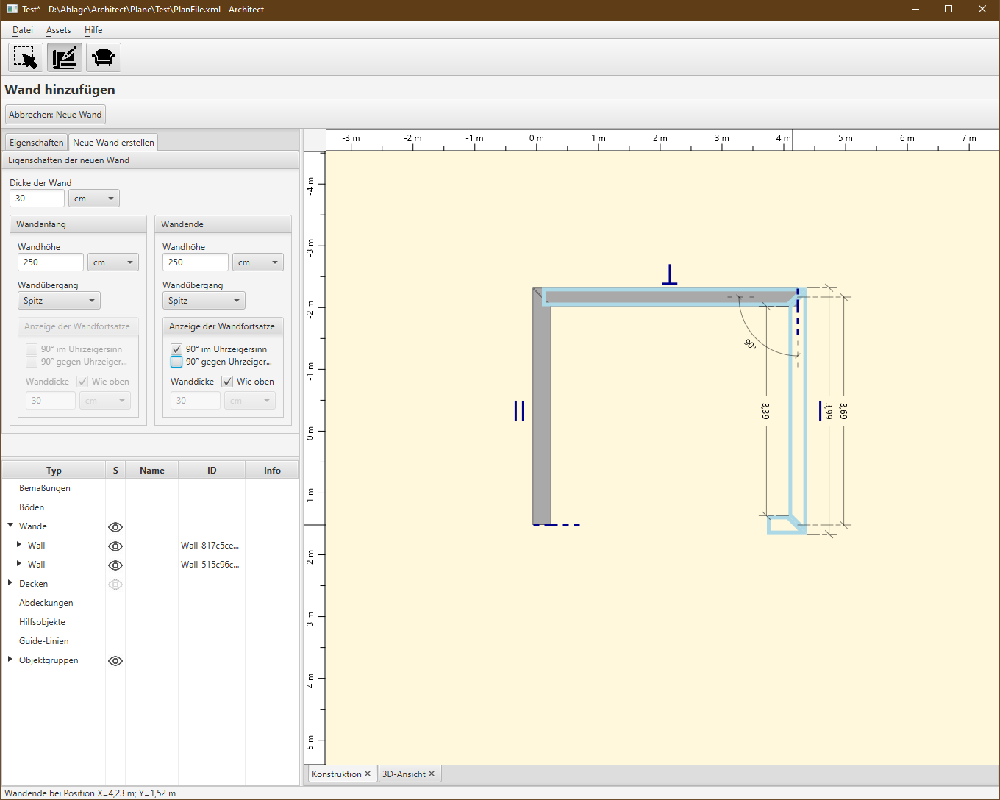
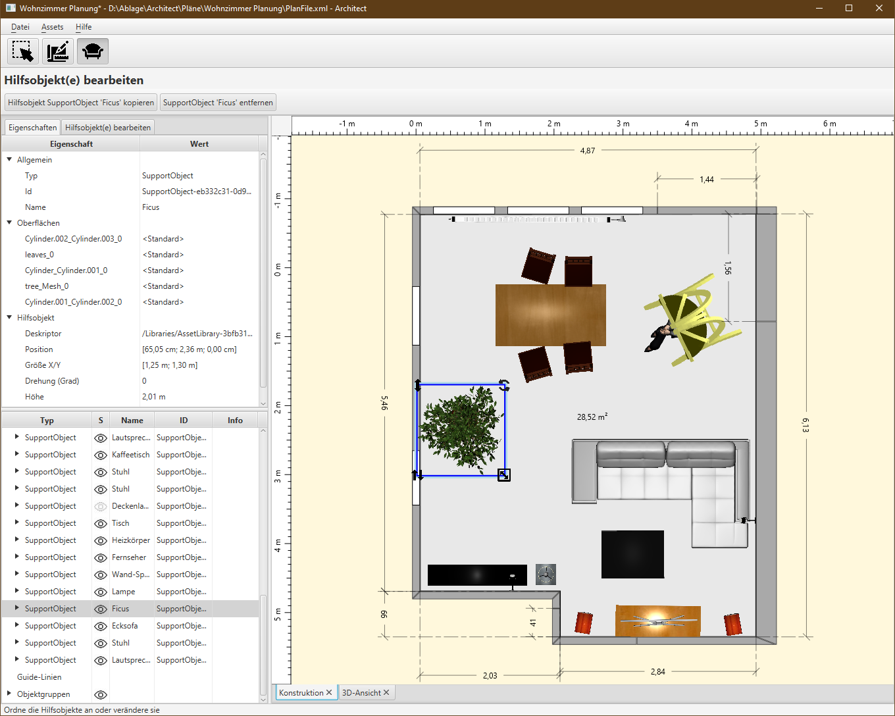
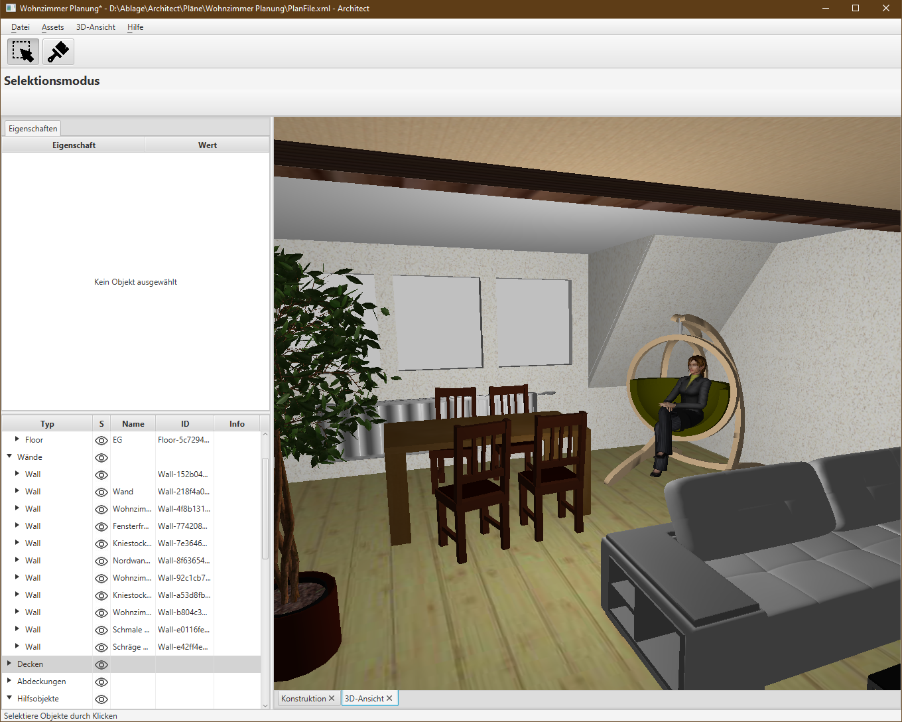

# Architect
2D/3D CAD Raum- und Wohnungsplaner

## Was ist Architect?
Architect ist ein **Grundriss-Planer** mit **3D-Ansichtsfunktion** als komplett quelloffenes Java-Programm. Wer es zum Laufen bekommt (siehe Quick-Start bzw. Installation unten), sollte mit der Bedienung keine Probleme haben. Etwas Technik-Affinität schadet nicht. Das Programm eignet sich gut, um eine Wohnung zu zeichnen, zu möblieren, in 3D darzustellen, Möbel/Wände/Oberflächen zu ändern und sich das Resultat in 3D darstellen zu lassen. Die Funktionalität ist vergleichbar mit SweetHome3D, es ist nicht so ausgereift, dafür aber moderner und kann ein paar Dinge besser, z.B. Dachschrägen, bessere 3D-Darstellung und Usability, ...
Die Oberfläche liegt aktuell nur in deutscher Sprache vor.
Funktional liegt der Fokus auf **Wohnungsplanung** und **Innenarchitektur**, also der Visualisierung einer Wohnung.
Als Anwendungsentwickler ist mir neben guter Usability vor allem die Codearchitektur sehr wichtig. Hier liegt mein Fokus auf durchdachter Softwarearchitektur, sauberer Programmierung, guter Wartbarkeit, einfacher Erweiterbarkeit aber auch durchdachter Benutzerführung und Anwendbarkeit.
Das Programm wird immer mal wieder erweitert und verbessert, ich nehme auch gerne sinnvolle Featurewünsche oder andere Vorschläge entgegen.

## Was ist Architect nicht?
Erwartet bitte (noch) kein komplett rundes, installierbares Programm. Es kann im aktuellen Zustand nur über Maven oder Eclipse gestartet werden. Wer einen Installer beisteuern will, nur her damit!
Das Programm ist aktuell ausschließlich in deutsch lokalisiert, andere Sprachen können programmatisch leicht ergänzt werden.

Außerdem:
- Architect ist keine BIM-Software, d.h. es können keine Baumaterialien modelliert werden (das ist auch nicht geplant)
- Architect ist ist nicht auf Kompatibilität zu anderen CAD-Programmen ausgelegt, d.h. es können (noch) keine Dateien aus anderen Formaten (Autodesk-Programme etc.) importiert oder in andere Formate exportiert werden
- Aufgrund der verwendeten 3D-Bibliothek (JavaFX) ist die Darstellung von indirektem Licht und Schattenwurf derzeit nicht oder nur sehr eingeschränkt möglich.

## Funktionen
- Wände, Türen und Fenster (aktuell nur Wand-Löcher, wird noch ausgebaut), Böden, Decken, Dachschrägen modellieren
- Möblierung und Objekte (Oberflächen-Begriff: Hilfsobjekte)
- Konfiguration ("Anmalen") von Oberflächen (Wände, Böden, Möbel, ...)
- 3D-Darstellung und intuitive, virtuelle Navigation durch das Objekt
- Möbel- und Oberflächenbibliotheksverwaltung
	- Eigenes Bibliotheksformat, Möbel/Hilfsobjekte werden im .obj-Format, Oberflächen im .mtl-Format mit zusätzlichen Metadaten verwaltet
	- Einfacher Editor zum Anlegen und Ändern von Möbeln und Oberflächen
	- Bibliotheksimporter für Möbel- und Oberflächenbibliotheken aus SweetHome3D

## Was kommt noch?
- Erweiterung des Plan-Modells, so dass in einer Datei / einem Workspace mehrere Pläne enthalten sind, die relativ zueinander platziert sind. Also z.B. pro Etage oder sogar pro Zimmer einen eigenen Plan, die in der 3D-Ansicht zusammen dargstellt werden.
Aktuell ist das noch etwas hakelig mit dem Dateihandling, da Architect das Verzeichnis einer Plan-Datei als Workspace ansieht, man aber die Plan-XML-Datei explizit anklicken muss zum Öffnen.
- Bessere Konfigurationsmöglichkeiten für Oberflächen auf Objekten, z.B. Lage, Skalierung und Drehung (z.B. für Dachziegeln, Tapeten- und Bodentexturen etc.)
- Türen und Fenster in Wandöffnungen, Modellierung von verschiedenen Etagen und Übergänge/Treppen
- Lampen, die auch leuchten :-)
- Weitere Arten von Hilfsobjekten, z.B. Balken, Treppen etc.
- ...

## Programmiersprache, Ausführung, Installation
#### Programmiersprache und Build-System
- Das Programm ist in Java geschrieben, die grafische Oberfläche verwendet JavaFX, das alles in Java 17 (Stand 2022)
- Das System besteht aus einer Handvoll Modulen, die mithilfe von Maven als Multi-Module-Project gebaut werden
- Das Programm, die Möbel- und Oberflächenbibliotheksverwaltung und der SweetHome3D-Bibliotheksimporter können aktuell nur nur aus Maven bzw. aus einer IDE (Eclipse) gestartet werden, gibt es noch keine Installation

### Quick-Start mit Maven
#### Benötigt:
- Apache Maven 3.x

#### Bauen und Ausführen über Maven:
- Download des Architect-Repositories über `git clone` oder als Verzeichnis
- Im Architect-Hauptverzeichnis: `mvn install`
- `cd main`
- `mvn javafx:run`

### Quick-Start mit Eclipse
#### Benötigt:
- Eclipse Standard, neuere Version
- JDK Version >=17, in Eclipse unter Preferences/Java/Installed JREs registriert

#### Ausführen über Eclipse:
- Download des Architect-Repositories über `git clone` oder als Verzeichnis
- Importieren der enthaltenen Projekte in Eclipse (Import/General/Existing Projects into Workspace)
- Ausführen von `de.dh.cad.architect.ArchitectApplication` im Projekt `main`

### Verwendung des Programms
Zu Beginn solltet ihr euch mit der Architect Hauptanwendung vertraut machen, sie läuft ohne weitere Vorbereitung. Macht euch mit der Mausbedienung vertraut, erstellt Wände, Böden, Decken, schaut euch das Resultat in 3D an und macht euch mit dem Konzept der Verbindungsanker vertraut.

Zur Gestaltung von Objektoberflächen (Wand-Texturen, Möbelfarben, ...) und zur Möblierung braucht ihr mindestens eine *Asset-Bibliothek*, die ihr mit dem Bibliotheksmanager anlegt. Dieser wird über das Architect-Menü oder als eigenständige Anwendung gestartet. Darin könnt ihr die einzelnen Oberflächen und Möbelstücke von Hand anlegen oder über den SweetHome3D-Importer aus dessen Bibliotheken bedienen. Ihr braucht die entpackten Bibliotheken, die dort im git im Projekt "3DModels" eingecheckt sind (Siehe https://svn.code.sf.net/p/sweethome3d/code/trunk).

Importiert die Java-Projekte in Eclipse und führt die Main-Klassen aus:
- **Hauptanwendung:** `de.dh.cad.architect.ArchitectApplication`
- **Bibliotheksverwaltung:** `de.dh.cad.architect.AssetManagerApplication`
- **SweetHome3D-Bibliotheksimporter:** `de.dh.cad.architect.libraryimporter.TextureImporterMain` und `de.dh.cad.architect.libraryimporter.SupportObjectsImporterMain`

## Motivation hinter Architect
Das Programm ist aus zwei Bedürfnissen entstanden:
1. Ich wollte eine kostenlose Visualisierungssoftware für meine neue Wohnung, mit der ich Änderungen (Wände einreißen, streichen, ... Möblierung, ...) planen kann ohne die Einschränkungen und Unzulänglichkeiten der am Markt verfügbaren Software
2. Ich brauchte eine nicht-triviale Java-Anwendung, mit der ich meinen Studenten die Kunst des Programmierens beibringen kann, klein genug, um sie vollständig überblicken zu können und groß genug, um daran Verfahren der Softwareentwicklung zu üben und Probleme zu diskutieren

Nach ein paar Gehversuchen mit der exzellenten JavaFX-Bibliothek wuchs bei mir schnell der Wunsch, auf dieser Basis eine größere Software zu bauen. So begann ich vor ein paar Jahren mit der Entwicklung von Architect. Seitdem entwickle ich das Programm immer mal wieder weiter.
